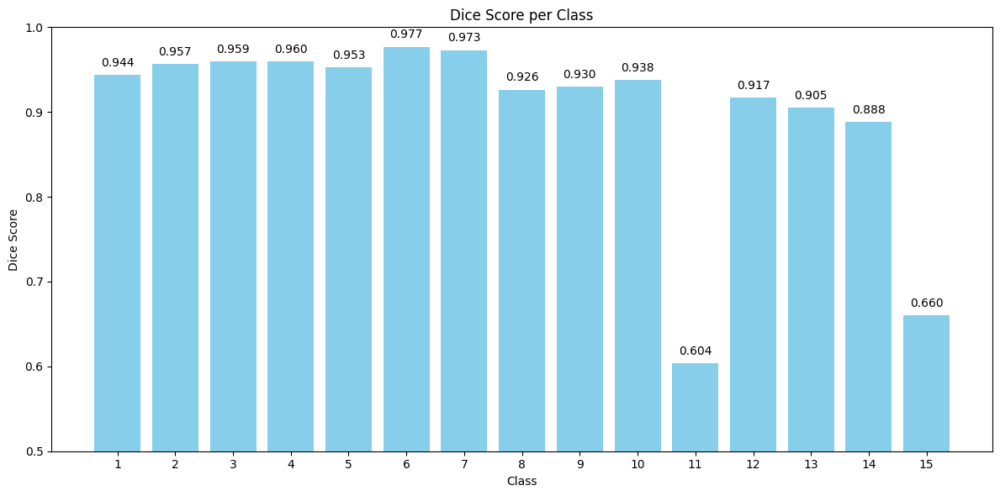
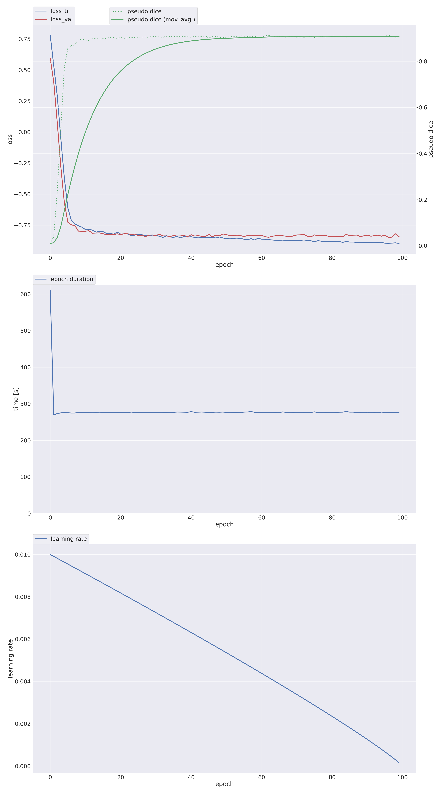
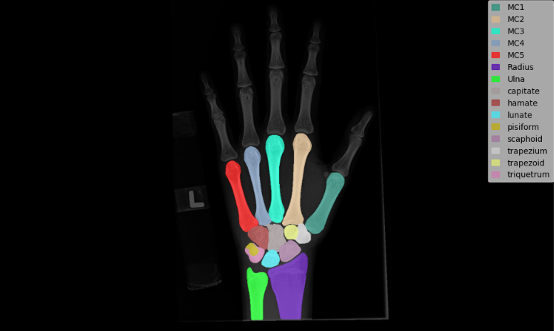
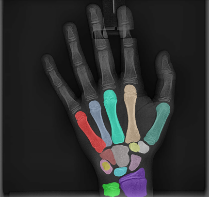

# Отчет Марценко Виталия (стажёра) по ходу стажировки "Создание системы ИИ-распознавания ряда ключевых параметров на снимках КТ («ННИИТО им. Я.Л. Цивьяна»)"

## Постановка задачи
Решаем задачу сегментации 15 костей лучезапястного сустава по рентгнетовским снимкам руки.  

Заказчиком была поставлена задача: 3d сегментация 15 костей лучезапястного сустава по dicom файлам со снимками КТ. Ввиду ограниченности датасета и вычислительных ресурсов, было принято решение рассмотреть задачу 2d сегментации с использованием фреймворка nn-Unet. Фреймворк автоматически подбирает параматры для обучения модели, и позволяет выбрать конфигурацию: 2d или 3d.
```
names: ['MC1', 'MC2', 'MC3', 'MC4', 'MC5', 'Radius', 'Ulna', 'capitate', 'hamate', 'lunate', 'pisiform', 'scaphoid', 'trapezium', 'trapezoid', 'triquetrum']
```

## Решение
### Шаг 1.Разметка датасета
Разметка выполнялась в roboflow участниками стажировки. В результате, был подготовлен датасет из 431 рентгеновского снимка.  
Ссылка на датасет: <https://universe.roboflow.com/martsenko/new-hand-xray-lbbnn/dataset/3>

### Шаг 2.Подгтовка датасета
Датасет был выгружен в формате YoloV9, но для nn-Unet нужны маски сегментации, для этого написал функции конвертации датасета из формата Yolo в формат nn-Unet.

### Шаг 3.Обучение модели
По умолчанию, nn-Unet обучает 5 фолдов кросвалидации по 1000 эпох каждый. Так как у меня были ограничены ресурсы, поменял настройки обучения: 
1. Датасет был разбит на тренировочную и проверочную выборки 80/20 c 1 фолдом.
2. Обучение 100 эпох  

Модель показала результат **Mean Validation Dice: 0.8994** на проверочной выборке.   

*Результаты Mean Validation Dice по классам*


Классы 11 и 15 были размечены не совсем корректно (каждый по своему размечал), поэтому по ним такой завал.

*График обучения модели*


Ноутбук с обучением модели: [Wrist_joint_segmentation_nnU_Net.ipynb](Wrist_joint_segmentation_nnU_Net.ipynb)

### Шаг 4.Тестирование модели
1. Для тестирования модели написал функцию для подготовки тестовых данных под формат nn-Net.
   
*Тестовый пример из датасета*  

  
*Тестовый пример из интернета*  



## Выводы
Модель nn-Unet показала хорошие результаты на 2d датасете. Фреймворк nn-Unet можно применить для решения задачи 3d сегментации по снимкам КТ.
Для этого необходимо выполнить разметку датасета по dicom файлам в 3d-slicer (с применением плагина MedSAM) и выбрать конфигурацию nn-Unet 3d.


## Использованные инструменты:
- **Язык программирования:** Python
- **Библиотеки:** nn-Unet, NumPy, Matplotlib, OpenCV
- **Среда разработки:** Jupyter Notebook / Google Colab / Kaggle Notebook
